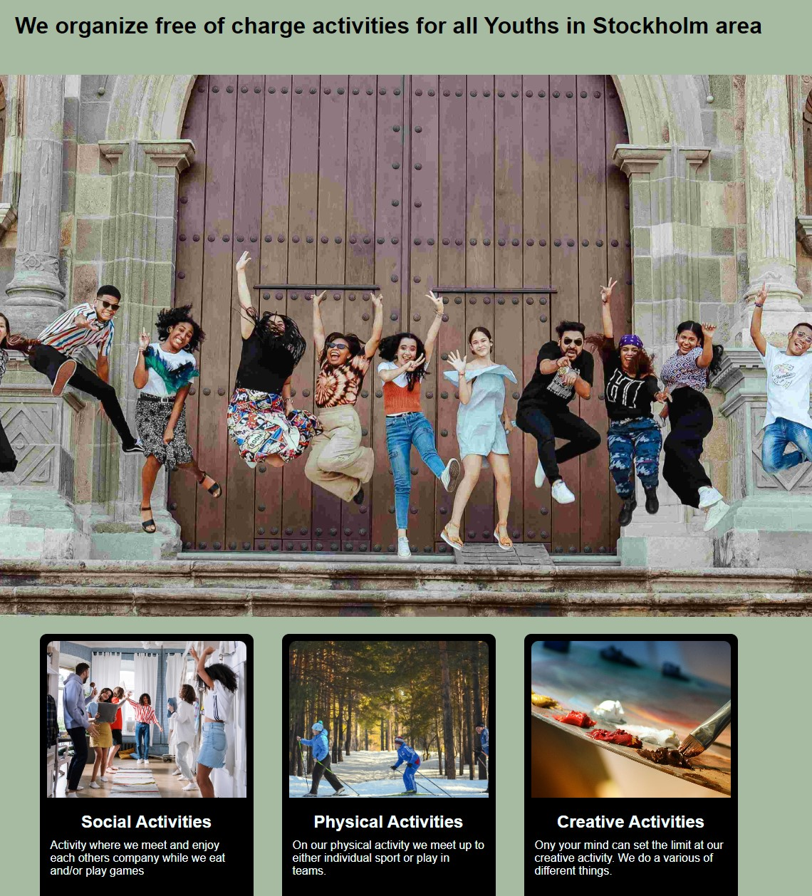
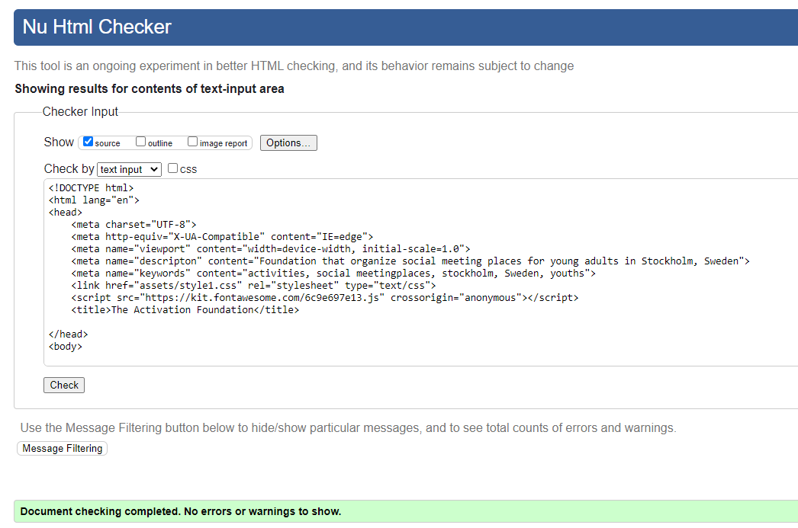
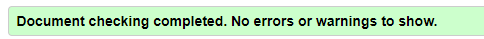
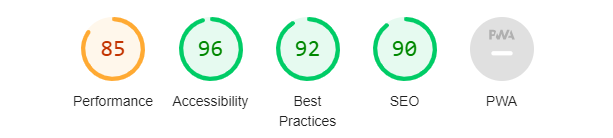
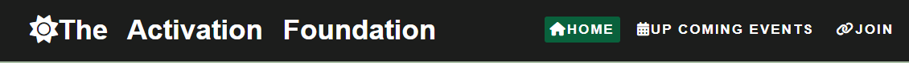

# the Acivation Foundation (projectname in Github is Project-15feb)
 
 
The Activation Foundation website is a website for the youth in stockholm to know about free of charge activities. It gives information about types of activities and place and time. Because of various activities the foundation should give the impression that there should be something for everyone. There is also a link to join or basically send the foundation a message.
 
 

This screenshot of index-page also demonstrate that it is for both girls and boys.
 
 

This screenshot of index-page also demonstrate that it is for both girls and boys.

