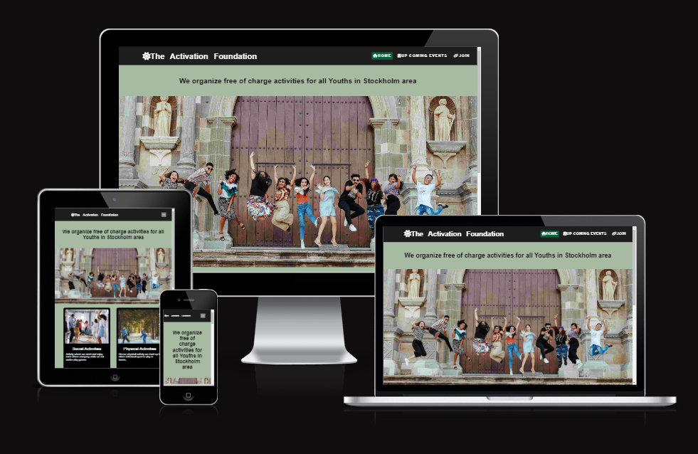
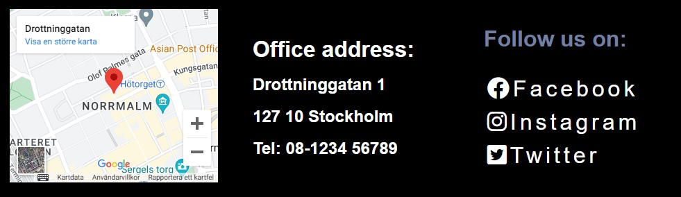

# the Acivation Foundation (projectname in Github is Project-15feb)
 
 
The Activation Foundation website is a website for the youth in stockholm to know about free of charge activities. It gives information about types of activities and place and time. Because of various activities the foundation should give the impression that there should be something for everyone. There is also a link to join or basically send the foundation a message.
 
 

 
 
 
 
 

## Features

Includes a navigation at the top of the page. It shows the name in the left corner - which also is a clickable link to "home". The navigation is to the right and they will also let the user know were they are on the site. The whole website uses the same colors. They are chosen to make sure there is contrast throughout the site. 
 
There is also a hovering effect on the links at the site.

 
 

 
 
 

This screenshot of index-page also demonstrate that it is for both girls and boys. What kind of activitis, this shouold also illustrate that we have fun together and be welcomed. And a little bit about what to expect from the different activities.

 
 
 

The footer gives information about where our office are, the phonenumber and also links to social media.

 
 

## Testing
 
Been tested with diffrent browsers. The site is responsive and looks great in different sizes
 
 

## Bugs
 
Discovered some bugs that was fixed when validated the site. Extreme good learning to build site like this.
 
 

## Validator testing
 
HTML - No errors wher found when passing through the official W3C validator
 

 
CSS - No errors wher found when passing through the official W3C validator
 

 
Accessibility - colors and font are easy to read
 

 
 

## Unfixed bugs
 
No unfixed bugs
 

## Deployments
 
The site was deployed to GitHub pages. The live link: https://github.com/MarcusYA/Project-15feb
 
 

## Credits
 
Youtube,codecademy,codeinstitute
 

### Media
The images was taken from Pexels and I took font images from Fontawsome

